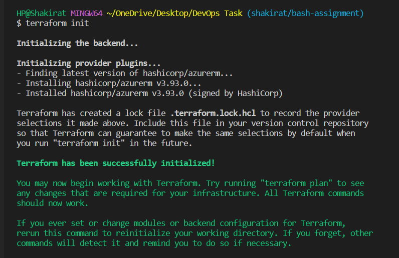
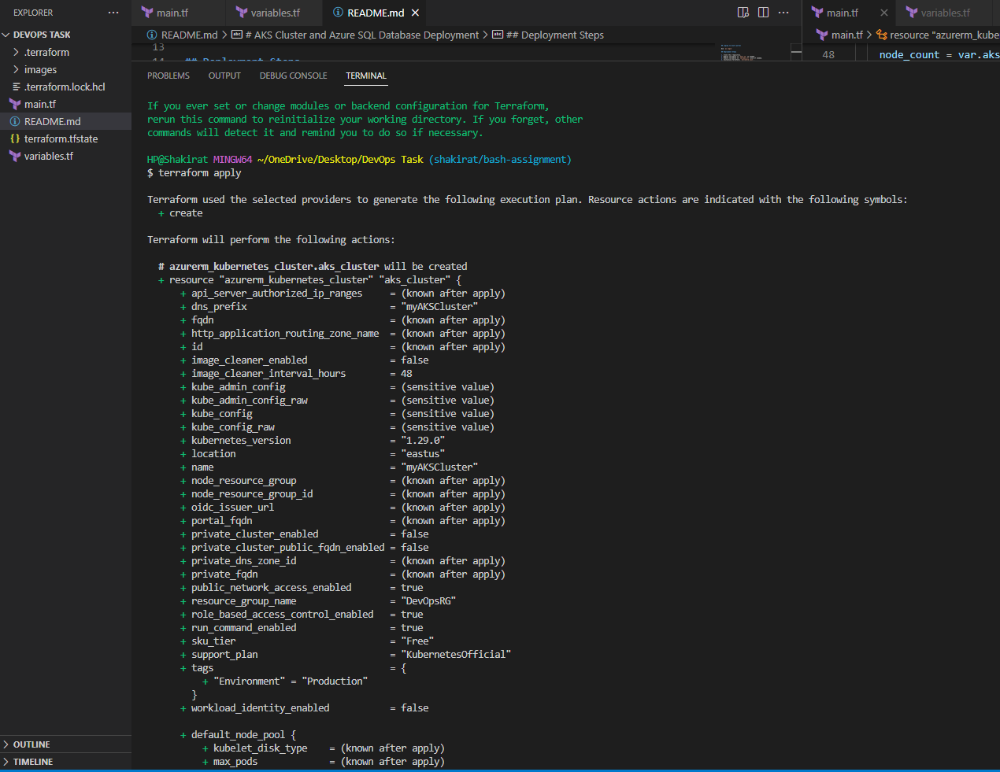
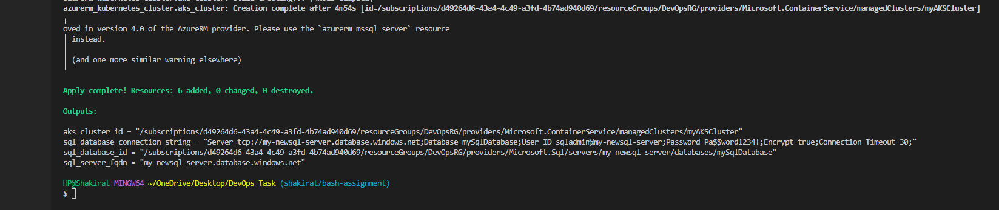
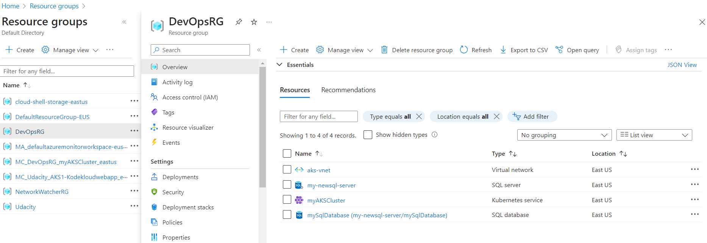
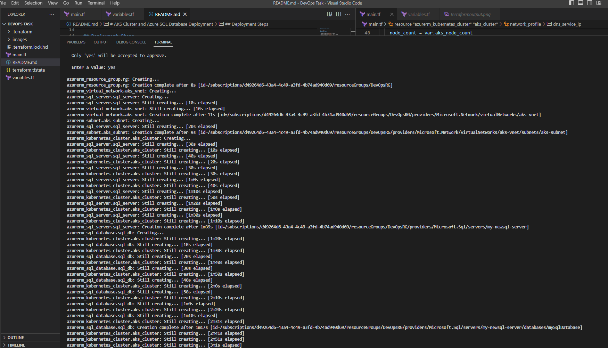
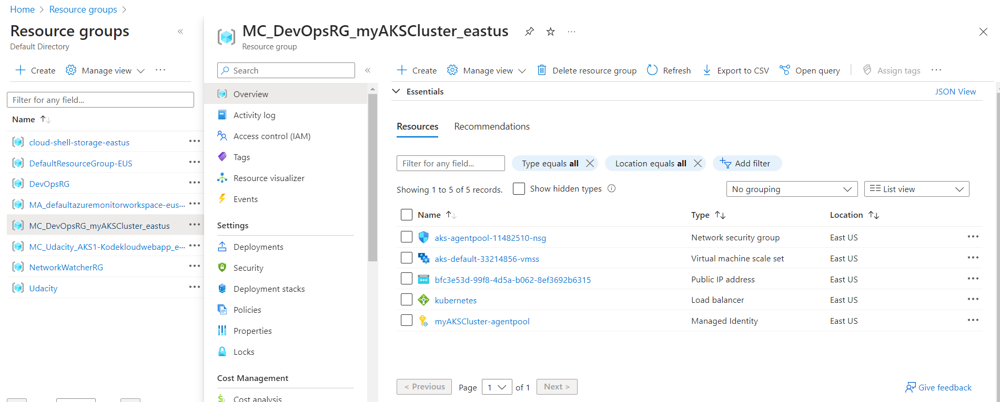
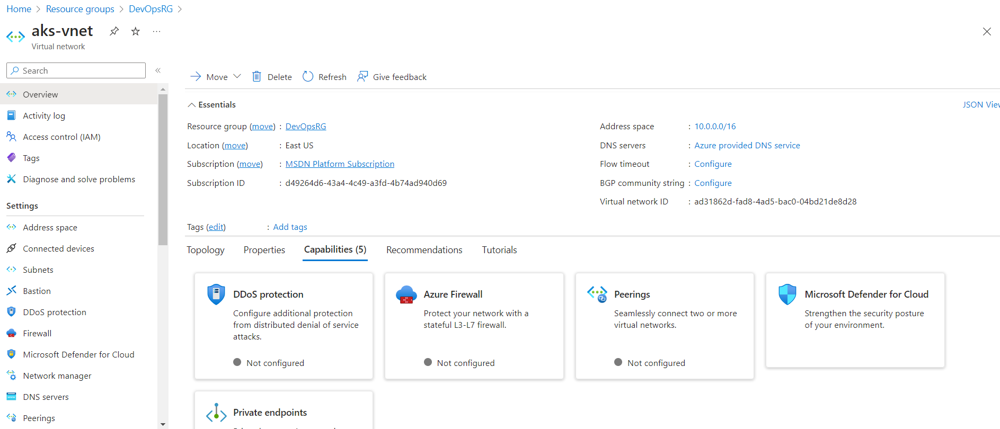
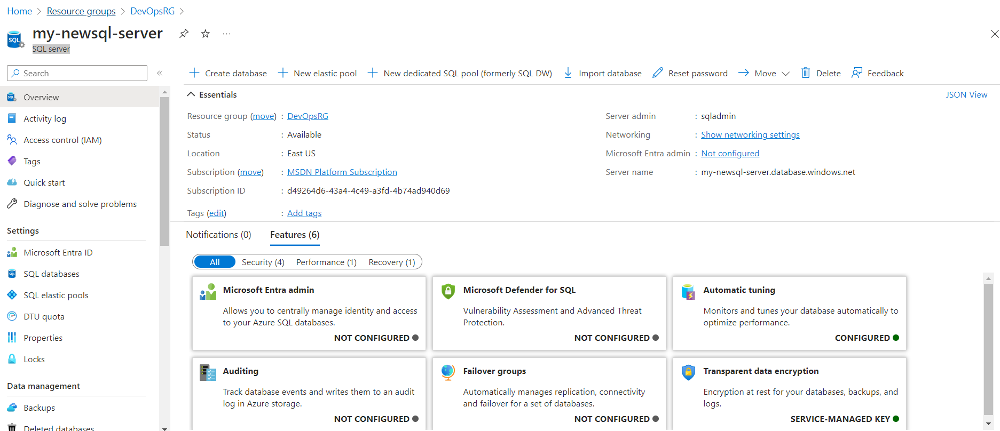

# Question Answered 
## Part III
Setup an AKS cluster and Azure SQL Database 
Write a terraform code to deploy an AKS cluster running on two nodes that should  be deployed into a new Azure Virtual Network.

# AKS Cluster and Azure SQL Database Deployment

This Terraform configuration deploys an Azure Kubernetes Service (AKS) cluster with two nodes, and an Azure SQL Database.

## Prerequisites

- Azure CLI installed
- Azure subscription

## Loging to Azure portal

Use `az login`

## Deployment Steps

1. Clone this repository.
2. Modify variables in `main.tf` if needed.
2. Modify variables in `variable.tf` also if needed.
3. Initialize Terraform: `terraform init`.
4. Apply the configuration: `terraform apply`.
5. Review the changes and confirm by typing `yes`.
6. After successful deployment, check Azure Portal for provisioned resources.

### terraform init

### terraform apply

### terraform Output

## Resources Created

- Azure Resource Group
- AKS Cluster
- Azure SQL Server
- Azure SQL Database
- Virtual Network
- Subnet

### Azure Resource Group

### Azure Resource Created

### Azure Managed Resource Created

### Azure virtual Network

### SQL server

## Clean Up

To avoid incurring charges, run `terraform destroy` to delete all created resources when they are no longer needed.
